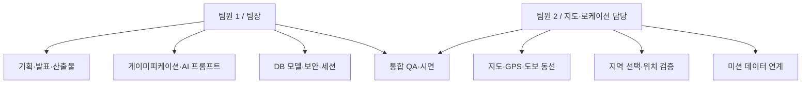

# Operation KOREA 팀원별 진행사항 및 완료 계획

작성 기준: 2026-05-14  
목적: 팀원별 담당 영역, 현재 완료된 작업, 프로젝트 완료까지 남은 작업을 발표/관리용으로 추적한다.

## 1. 팀 운영 구조

현재 문서는 실제 팀원 실명 확인 전 단계이므로 `팀원 1`, `팀원 2`로 표기한다. 제출 전 실명과 학번/소속이 필요하면 이 표를 교체한다.

팀 운영은 팀장 중심의 수직 조율 구조로 두되, 구현 책임은 `AI/게임/보안`과 `지도/위치/데이터 연동`으로 나눈다. 기능이 겹치는 DB 영역은 팀원 1이 모델과 보안 정책을 책임지고, 팀원 2가 지도·위치 데이터가 DB에 저장되고 조회되는 흐름을 책임진다.

## 2. 역할 정의

| 팀원 | 역할 | 담당 범위 |
| --- | --- | --- |
| 팀원 1 / 팀장 | PM, AI, 게이미피케이션, DB/보안 총괄 | 제안서/발표자료, 게임 규칙, Gemini 프롬프트, 정답 판정, 회원/권한, 세션/점수, 문서 관리 |
| 팀원 2 | 지도, 로케이션, DB 연계 | Kakao 지도, GPS 위치, 권역 지도, 마커/동선, Tmap 도보 경로, TourAPI 후보지, 위치 기반 DB 연동 |
| 공통 | QA, 시연, 발표 | 현장 플로우 점검, 화면 캡처, 시연 데이터, 발표 리허설 |

### 2.1 세부 책임 경계

| 영역 | 최종 책임 | 협업 방식 |
| --- | --- | --- |
| 게이미피케이션 규칙 | 팀원 1 | 힌트 개수, 최종 채팅, 점수/시간/거리 기준을 정의하고 팀원 2가 지도 UI에 반영 |
| AI 프롬프트 | 팀원 1 | 브리핑, 힌트, 정답 판정, 클리어 리포트 품질 관리 |
| DB/보안 | 팀원 1 | 회원, 권한, 세션, 미션 상태 모델과 JWT 보안 관리 |
| 지도/로케이션 | 팀원 2 | Kakao 지도, GPS, 권역 지도, 마커, 도착 판정 UI 관리 |
| TourAPI/POI 연동 | 팀원 2 | 후보지 수집과 좌표 품질을 관리하고 팀원 1이 AI 작전 생성에 활용 |
| 위치 기반 DB 연계 | 팀원 2 | 지도에서 필요한 지역/미션/좌표 데이터 조회 흐름 점검 |

## 3. 팀원 1 완료사항

| 영역 | 완료사항 | 관련 파일/화면 |
| --- | --- | --- |
| 프로젝트 기획 | 문제 정의, 대상 사용자, 핵심 가치, 제안서 방향 정리 | `README.md`, `docs/PROJECT_PLANNING.md` |
| 게이미피케이션 | 힌트 미션 3개 + 최종 미션 1개 구조, 단서 수집, 최종 정답 추리 흐름 설계 | `GeminiAiService`, `MapView`, `AiChatView` |
| AI 작전 생성 | TourAPI/POI 기반 브리핑, 힌트, 정답, 실제 역사 해설 생성 프롬프트 구성 | `GeminiAiService` |
| AI 힌트/정답 판정 | 일반 힌트 요청과 가설 검증 요청 분리, 정답 직접 노출 방지 | `GeminiAiService` |
| 보안/인증 | 회원가입, 로그인, JWT 인증, 관리자 권한 보호 | `auth`, `SecurityConfig` |
| 세션/점수 | 미션 상태, 클리어 시간, 이동 거리, 점수 저장 | `GameSession`, `GameSessionController` |
| 클리어 리포트 | 실제 역사 해설, 단서별 해석, 점수 표시 흐름 구현 | `ClearView`, `GeminiAiService` |
| 문서화 | README, 통합 기획서, AI 활용 로그, WBS/간트/유스케이스 작성 | `README.md`, `docs` |

## 4. 팀원 2 완료사항

| 영역 | 완료사항 | 관련 파일/화면 |
| --- | --- | --- |
| 지역 선택 | 대한민국 권역 선택, 서울/강원/충북 등 지역별 카드 흐름 구현 | `HomeView`, `RegionController` |
| 지도 화면 | Kakao 지도 로딩, 마커 표시, 현재 위치, 최종 거리 표시 | `MapView` |
| 위치 판정 | GPS 기반 현재 위치와 미션 좌표 거리 계산, 도착 반경 UI | `MapView`, `MissionService` |
| 도보 동선 | Tmap 보행자 경로 API 기반 경로 표시 및 후보 필터링 | `MapView`, `AdminMissionController` |
| 주변 POI | Kakao/TourAPI 후보를 활용한 subSpot 구성 지원 | `AdminMissionController`, `TourApiService` |
| 현장 인증 UI | 카메라 모달, 촬영, 실패/성공 피드백 연결 | `CameraScanner`, `MapView` |
| 힌트 UI | 힌트 획득 카드, 획득 단서 모달, 클릭 시 접힘 효과 | `MapView` |

## 5. 현재 전체 진행상태

| 구분 | 진행률 | 상태 |
| --- | --- | --- |
| 기획/제안서 반영 | 85% | 제안서 핵심 내용과 산출물 초안 반영 완료, 발표자료 제작 필요 |
| 회원관리 | 80% | 가입/로그인/JWT 구현, 관리자 승격 UI는 미구현 |
| 콘텐츠/미션 생성 | 80% | TourAPI + AI 작전 생성 구현, 생성 품질 QA 필요 |
| 지도/위치 | 85% | Kakao 지도/GPS/Tmap 구현, 현장 QA 필요 |
| 현장 인증 | 70% | Vision 기반 인증 구현, OCR/객체 혼합 고도화 필요 |
| AI 채팅 | 80% | 힌트/가설 검증/정답 판정 구현, 프롬프트 품질 지속 조정 |
| 클리어/점수 | 75% | 점수/시간/거리/역사 해설 구현, 공유/리뷰 미구현 |
| 커뮤니티 | 10% | 리뷰/팔로우/랭킹/UGC는 설계 단계 |
| 제출 문서 | 75% | README/기획서/WBS/간트/유스케이스 초안 완료, PPT와 화면 캡처 필요 |
| 시연 준비 | 40% | 로컬 빌드 가능, IDE 없는 시연 패키지와 DB seed 필요 |

## 6. 제안서 및 추가 요구사항 반영 현황

| 항목 | 현재 반영 상태 | 남은 작업 |
| --- | --- | --- |
| 국내 관광 위기/해외여행 선호 배경 | README와 통합 기획서에 반영 | 발표자료 첫 문제 정의 슬라이드에 압축 필요 |
| TourAPI 기반 미션 자동 생성 | 관리자 후보 조회와 AI 작전 생성으로 구현 | 생성 품질 QA와 샘플 작전 seed 준비 |
| Kakao 지도/GPS 현장 미션 | 지도, 마커, 현재 위치, 도착 판정 구현 | 시연 PC의 Kakao 도메인/API 키 점검 |
| Vision 기반 현장 인증 | 카메라 캡처와 이미지 분석 흐름 구현 | 실패 케이스 메시지와 OCR 정확도 QA |
| Gemini 기반 브리핑/힌트/채팅 | 프롬프트와 정답 판정 흐름 구현 | 특정 주제 하드코딩 여부 계속 점검 |
| 다국어/무장애/두루누비 API | 문서상 확장 계획으로 반영 | 실제 구현 시 API 키, 데이터 매핑, 코스 필터 설계 필요 |
| 기상청 단기예보 API | 안전/난이도 조정 확장 계획으로 반영 | 실내 미션 대체 정책 정의 필요 |
| 리뷰/팔로우/랭킹/UGC | 팀원별 진행 문서에 데이터 모델 초안 반영 | 리뷰 기능부터 최소 구현 여부 결정 |
| B2G/지역 리워드/인사이트 | 장기 발전 방향으로 문서화 | MVP와 장기 계획이 섞이지 않도록 발표 문구 정리 |

## 7. 프로젝트 완료까지 남은 작업

### 7.1 최우선 작업

| 우선순위 | 작업 | 담당 | 완료 기준 |
| --- | --- | --- | --- |
| P0 | 리뷰 기능 최소 구현 | 팀원 1 + 팀원 2 | 미션별 별점/한줄평 등록·조회 가능 |
| P0 | 시연용 DB seed | 공통 | 관리자 계정, 샘플 지역, 샘플 미션 포함 |
| P0 | IDE 없는 실행 패키지 | 공통 | `app.jar`, `application-local.properties`, `start.bat`로 실행 |
| P0 | 발표 화면 캡처 | 팀원 2 | 핵심 화면 8개 이상 캡처 |
| P0 | 발표 PPT 제작 | 팀원 1 | 10~13장 발표자료 완성 |

### 7.2 기능 안정화

| 작업 | 담당 | 세부 내용 |
| --- | --- | --- |
| 카카오맵 키 점검 | 팀원 2 | 시연 PC 도메인/localhost 등록, SDK 로딩 실패 대응 |
| GPS 현장 QA | 팀원 2 | 실외/실내 GPS 오차 확인, 도착 반경 조정 |
| AI 프롬프트 QA | 팀원 1 | 정답 직접 노출, 특정 주제 하드코딩, 실제 역사 왜곡 점검 |
| Vision 인증 QA | 팀원 1 | 객체/텍스트 인식 실패 시 오류 메시지와 재시도 흐름 점검 |
| 클리어 리포트 QA | 팀원 1 | 실제 역사 설명과 게임 서사 구분 확인 |

### 7.3 제출 제약 대응

| 제약 | 현재 상태 | 대응 |
| --- | --- | --- |
| Spring 중심 구성 | Spring Boot 사용 | 유지 |
| Vue 3 | Vue 3 사용 | 유지 |
| MySQL | MySQL 사용 | 유지 |
| MyBatis 중심 | JPA 제거 및 MyBatis Mapper 전환 완료 | `schema.sql`과 Mapper SQL 기준으로 DB 구조 관리 |
| JSP | 현재 SPA 구조 | 과제 요구가 JSP 필수인지 확인 필요 |
| JPA/React/S3 제한 | JPA 제거 완료, React/S3 미사용 | JSP 필수 여부만 추가 확인 |

## 8. 공공 API 확장 담당 계획

| API | 담당 | 적용 시점 | 작업 내용 |
| --- | --- | --- | --- |
| TourAPI 국문관광정보 | 팀원 2 + 팀원 1 | 구현됨 | 후보지 수집, 상세 설명, AI 작전 생성 원천 데이터 |
| TourAPI 다국어 관광정보 | 팀원 1 | 확장 | 외국인 사용자용 다국어 브리핑/힌트/해설 |
| 무장애 관광정보 API | 팀원 2 | 확장 | 휠체어/유모차 접근 가능 미션 코스 필터 |
| 두루누비 걷기여행 코스 API | 팀원 2 | 확장 | 걷기 좋은 길 기반 힌트 동선 추천 |
| 기상청 단기예보 API | 팀원 2 | 확장 | 날씨 악화 시 실내 미션/난이도 조정 |
| Kakao Map/Local | 팀원 2 | 구현됨 | 지도 표시, 주변 POI, 위치 UX |
| Tmap Pedestrian | 팀원 2 | 구현됨 | 보행 경로와 이동 가능성 보정 |
| Gemini/Vision | 팀원 1 | 구현됨 | 시나리오, 힌트, 정답 판정, 현장 인증 |

## 9. 커뮤니티 확장 담당 계획

| 기능 | 담당 | 데이터 모델 초안 | 설명 |
| --- | --- | --- | --- |
| 미션 리뷰 | 팀원 1 | `Review(userId, regionId, rating, content, createdAt)` | 미션 완료 후 별점/한줄평 등록 |
| 찜/즐겨찾기 | 팀원 2 | `Favorite(userId, regionId)` | 나중에 할 작전 저장 |
| 팔로우/팔로잉 | 팀원 1 | `Follow(followerId, followingId)` | 제작자/플레이어 관계 형성 |
| 랭킹 | 팀원 1 | `Ranking(regionId, userId, score, elapsedSeconds, distance)` | 점수, 시간, 거리 기반 순위 |
| 사용자 생성 미션 | 팀원 1 + 팀원 2 | `UserMission`, `UserMissionSpot` | 사용자가 TourAPI 장소를 조합해 미션 제작 |
| 미션 신고/검수 | 팀원 1 | `MissionReport`, `ModerationStatus` | UGC 품질과 부적절 콘텐츠 관리 |

## 10. B2G 및 지역 상생 확장 담당 계획

| 기능 | 담당 | 적용 시점 | 설명 |
| --- | --- | --- | --- |
| 지역 상생 리워드 | 팀원 1 | 확장 | 서브 미션 완료 시 주변 상점 쿠폰, 지역사랑상품권 보상 정책 설계 |
| 로컬 상권 POI 고도화 | 팀원 2 | 확장 | Kakao Local 또는 공공데이터를 활용해 주변 상권과 힌트 동선 연결 |
| 지자체 인사이트 대시보드 | 팀원 1 + 팀원 2 | 장기 | 체류 시간, 이동 동선, 힌트 사용 위치를 비식별 통계로 분석 |
| 지역 템플릿 패키지 | 팀원 1 | 장기 | 경주, 부산, 강원 등 지역별 스토리 템플릿을 AI 생성 프롬프트에 반영 |

## 11. 완료 기준

프로젝트 완료는 단순 구현 완료가 아니라 발표와 시연 가능 상태를 의미한다.

| 기준 | 완료 조건 |
| --- | --- |
| 기능 완료 | 회원가입부터 클리어 리포트까지 단일 작전 시연 가능 |
| 공통 요구사항 | 콘텐츠, 리뷰, 회원관리 기능 설명 또는 구현 |
| 산출물 완료 | README, WBS, 간트차트, 유스케이스, 화면 설계, PPT, AI 로그 준비 |
| 시연 완료 | IDE 없이 `start.bat` 또는 명령어 1~2개로 실행 가능 |
| 데이터 준비 | 관리자 계정과 샘플 작전이 DB에 준비됨 |
| 리스크 설명 | JSP 필수 여부, 추가 공공 API, 미구현 커뮤니티 기능의 상태를 발표에서 명확히 구분 |

## 12. 발표 시 역할 분담

| 순서 | 발표 내용 | 담당 |
| --- | --- | --- |
| 1 | 문제 정의와 서비스 기획 배경 | 팀원 1 |
| 2 | 사용자와 해결 전략 | 팀원 1 |
| 3 | 데이터/API 활용 구조 | 팀원 2 |
| 4 | 지도/로케이션/현장 인증 데모 | 팀원 2 |
| 5 | AI 시나리오/채팅/클리어 리포트 데모 | 팀원 1 |
| 6 | 향후 확장: 다국어, 무장애, 두루누비, UGC, 랭킹 | 팀원 1 + 팀원 2 |
| 7 | 기대효과와 마무리 | 팀원 1 |
